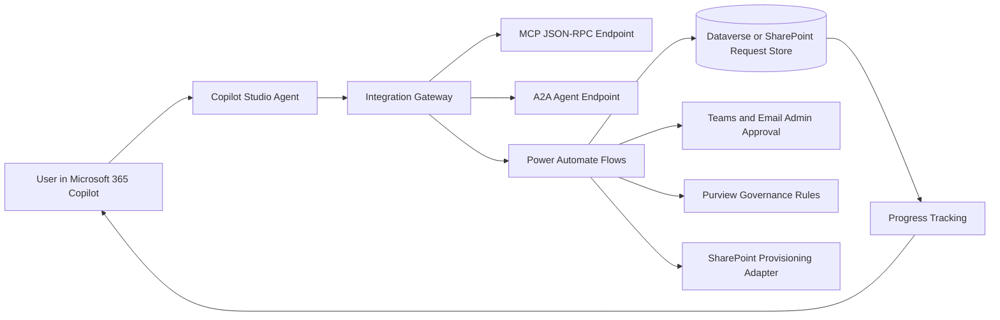

# SharePoint Site Request Agent

Reference implementation for a packaged SharePoint site request/provisioning agent.

The solution is intentionally safe by default: it builds the request, approval, governance, MCP, and A2A integration contracts, but it does not provision tenant resources until a customer-specific provisioning adapter is implemented and enabled.

## Architecture



## What is included

- TypeScript integration gateway with:
  - health endpoint
  - A2A agent card and task endpoint
  - MCP-style JSON-RPC endpoint
  - REST endpoints for Copilot Studio actions
- Request schema and governance evaluation logic
- Local file-backed request store for development
- Power Automate flow specifications
- Purview governance rule template
- Scripts for validation and packaging

## What is not included

- No live SharePoint site creation
- No tenant configuration
- No Purview policy creation
- No Power Platform environment provisioning

Those are deliberately left as deployment-time adapters.

## Quick start

```powershell
npm install
npm run validate
npm run dev
```

Open:

- `GET http://localhost:3978/health`
- `GET http://localhost:3978/.well-known/agent-card.json`
- `POST http://localhost:3978/api/requests`
- `POST http://localhost:3978/mcp`
- `POST http://localhost:3978/a2a/tasks`

## Copilot Studio integration

Create custom actions that call:

| Action | Endpoint |
|---|---|
| Create site request | `POST /api/requests` |
| Get request status | `GET /api/requests/{id}` |
| List pending requests | `GET /api/requests?status=pending_approval` |
| Approve request | `POST /api/requests/{id}/approve` |
| Reject request | `POST /api/requests/{id}/reject` |

## MCP tools

The `/mcp` endpoint exposes JSON-RPC handlers for:

- `tools/list`
- `tools/call`

Supported tools:

- `create_sharepoint_site_request`
- `get_sharepoint_site_request_status`
- `list_pending_sharepoint_site_requests`
- `approve_sharepoint_site_request`
- `reject_sharepoint_site_request`
- `validate_external_domain_policy`

## A2A capabilities

The A2A agent card is available at:

```text
/.well-known/agent-card.json
```

The task endpoint accepts:

```text
POST /a2a/tasks
```

Supported task types:

- `site-request.create`
- `site-request.status`
- `site-request.approve`
- `site-request.reject`

## Power Automate

The files in `power-automate/flow-specs` are implementation specifications for cloud flows:

- `01-create-request.json`
- `02-admin-approval.json`
- `03-provision-site.json`
- `04-status-notification.json`

They can be translated into Power Platform solution components for the target tenant.

## Recommended production backing services

| Concern | Recommended service |
|---|---|
| Request ledger | Dataverse |
| User UI | Microsoft 365 Copilot |
| Agent orchestration | Copilot Studio |
| Workflow | Power Automate |
| Governance | Microsoft Purview |
| Provisioning | Microsoft Graph + SharePoint Admin APIs |
| Integration gateway | Azure Functions or Azure Container Apps |
